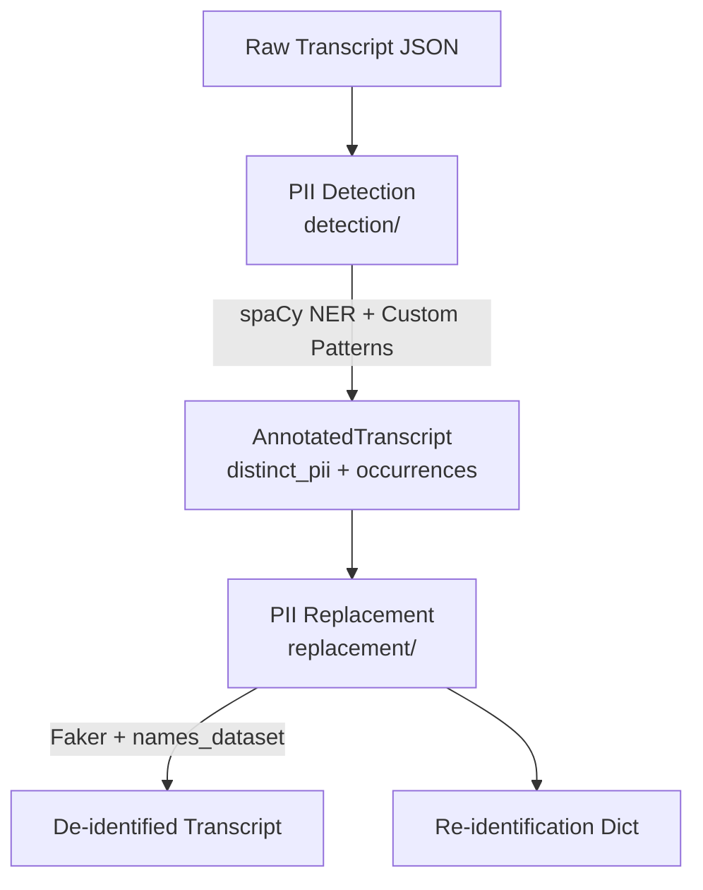

# Transcript De-identification Pipeline

A modular pipeline for detecting and replacing Personally Identifiable Information (PII) in educational transcript data, designed to comply with FERPA, COPPA, and HIPAA requirements.

## Motivation

Educational tutoring sessions generate transcripts containing sensitive student information including names, schools, locations, ages, and contact information. This pipeline provides:

1. **Automated PII Detection**: Uses spaCy NER with custom patterns optimized for ASR (Automatic Speech Recognition) transcripts
2. **Intelligent Replacement**: Generates realistic fake data that preserves characteristics (name initials, gender, cultural origin)
3. **Flexible Configuration**: Supports replace or redact modes per PII category
4. **Reproducibility**: Seed-based generation for consistent de-identification

## Project Structure

```
deidentification_process/
├── README.md                    # This file
├── pipeline.ipynb               # End-to-end demonstration notebook
├── shared_resources/            # Shared schemas and constants
│   ├── __init__.py
│   ├── schemas.py              # Pydantic data models
│   └── constants.py            # Shared configuration
├── detection/                   # PII Detection module
│   ├── __init__.py
│   ├── settings.py             # Detection configuration
│   ├── detector.py             # Main PiiDetector class
│   ├── app.py                  # CLI application
│   └── tests/                  # pytest tests
│       ├── __init__.py
│       └── test_detector.py
└── replacement/                 # PII Replacement module
    ├── __init__.py
    ├── settings.py             # Replacement configuration
    ├── name_replacer.py        # Intelligent name replacement
    ├── replacement_generator.py # All PII type replacement
    ├── deidentifier.py         # Transcript de-identification
    ├── app.py                  # CLI application
    └── tests/                  # pytest tests
        ├── __init__.py
        └── test_replacement.py
```

## PII Categories

| Category | Description | Replacement Strategy |
|----------|-------------|---------------------|
| NAME | Person names | Initial-preserving with gender/cultural matching |
| LOCATION | Cities, states, countries | Fake city names (countries preserved) |
| SCHOOL | Educational institutions | Realistic school name templates |
| DATE | Specific dates | Format-preserving fake dates |
| AGE | Participant ages | ±5 years variation |
| PHONE | Phone numbers | Format-preserving fake numbers |
| EMAIL | Email addresses | Domain-type-preserving fake emails |
| URL | Web addresses | Structure-preserving fake URLs |
| MISC_ID | SSN, student IDs, usernames | Format-preserving fake IDs |

## Prerequisites

### Python Version
- Python 3.10+

### Required Packages
```bash
pip install spacy pydantic faker names-dataset structlog
python -m spacy download en_core_web_lg
```

### Full Requirements
```
spacy>=3.5.0
pydantic>=2.0.0
faker>=18.0.0
names-dataset>=3.0.0
structlog>=23.0.0
pytest>=7.0.0  # for testing
```

## Quick Start

### 1. Detection (Finding PII)

```python
from detection import PiiDetector

detector = PiiDetector()
result = detector.detect("Hi Maria, I'm Austin from Lincoln High School.")

print(result.distinct_pii.NAME)     # ['Maria', 'Austin']
print(result.distinct_pii.SCHOOL)   # ['Lincoln High School']
```

### 2. Replacement (De-identifying)

```python
from replacement import TranscriptDeidentifier, create_actions_config

# Configure actions (replace or redact)
actions = create_actions_config(
    default_action="replace",
    redact=["EMAIL", "PHONE"]  # Redact these instead
)

# De-identify
deidentifier = TranscriptDeidentifier(seed=42)
deid_transcript, reid_dict = deidentifier.deidentify(
    ner_result=result,
    transcript={"utterances": [{"text": "Hi Maria!"}]},
    actions=actions
)
```

### 3. CLI Usage

```bash
# Detect PII
python -m detection.app detect transcript.txt -o detected.json

# De-identify transcript
python -m replacement.app deidentify transcript.json --ner detected.json -o deidentified.json
```

## Usage Examples

### Full Pipeline

```python
import json
from detection import PiiDetector
from replacement import TranscriptDeidentifier, create_actions_config

# Load transcript
with open("transcript.json") as f:
    transcript = json.load(f)

# Convert to text for detection
text = "\n".join(utt["text"] for utt in transcript["utterances"])

# Detect PII
detector = PiiDetector()
ner_result = detector.detect(text)

print(f"Found {ner_result.distinct_pii.count()} distinct PII items")

# Configure de-identification
actions = create_actions_config(default_action="replace")

# De-identify
deidentifier = TranscriptDeidentifier(seed=42)
deid_transcript, reid_dict = deidentifier.deidentify(
    ner_result, transcript, actions
)

# Save results
with open("deidentified.json", "w") as f:
    json.dump(deid_transcript, f, indent=2)

with open("reidentification.json", "w") as f:
    json.dump(reid_dict, f, indent=2)
```

### Custom Detection Settings

```python
from detection import PiiDetector
from detection.settings import DetectorSettings

settings = DetectorSettings(
    model_name="en_core_web_sm",  # Faster, smaller model
    min_name_rank=3000,           # Stricter name validation
    enable_asr_patterns=True,     # Detect spoken patterns
)

detector = PiiDetector(settings=settings)
```

### Reproducible Results

```python
# Same seed = same replacements
deidentifier1 = TranscriptDeidentifier(seed=42)
deidentifier2 = TranscriptDeidentifier(seed=42)

# Both will produce identical de-identified output
```

## Testing

```bash
# Run all tests
cd deidentification_process
pytest

# Run with coverage
pytest --cov=detection --cov=replacement

# Run specific module tests
pytest detection/tests/
pytest replacement/tests/
```

## Key Features

### Detection Features
- **ASR-aware**: Detects spoken patterns like "five five five one two three four" for phone numbers
- **Line-initial names**: Catches names at the start of utterances ("Jayden, can you help?")
- **Educational context filtering**: Avoids false positives from math problems
- **Bilingual support**: Filters Spanish false positives common in tutoring transcripts
- **Post-processing**: Reclassifies locations that are actually common names

### Replacement Features
- **Initial preservation**: "Maria" → "Morgan" (preserves M)
- **Gender preservation**: Female names replaced with female names
- **Cultural matching**: Names matched by country of origin
- **Format preservation**: Phone/date formats maintained
- **Consistent mapping**: Same input always produces same output (with seed)
- **Compound name handling**: "Tutor Williams" → "Tutor Wallace"

## Data Flow



## Known Limitations

1. **Math context**: Numbers in word problems may occasionally be flagged as ages
2. **Ambiguous names**: Some words can be both names and common words (e.g., "Rose")
3. **Compound names**: Very long compound names may not be detected as single units
4. **Non-English**: Primary support is for English; limited Spanish false-positive filtering

## Contributing

When adding new false positive filters or detection patterns:

1. Add to the appropriate settings file (`detection/settings.py` or `replacement/settings.py`)
2. Add corresponding test cases
3. Run the full test suite to ensure no regressions

## License

Internal use only. Contact the data science team for licensing questions.
